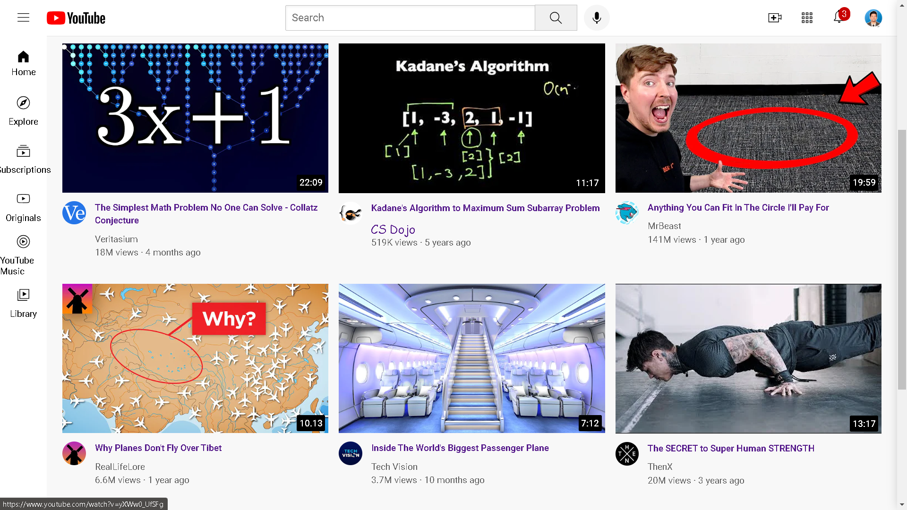

# YouTube Clone Project

Welcome to my YouTube Clone project! In this project, I've created a replica of the popular video-sharing platform using HTML and CSS. By implementing advanced CSS Grid and Flexbox techniques, I've ensured that the layout is responsive and adapts well to different screen sizes.

## Features

- Utilized HTML and CSS to recreate the YouTube interface.
- Implemented advanced CSS Grid and Flexbox techniques for responsive layouts.
- Hosted the project on GitHub for easy collaboration and version control.
- Experience seamless navigation and optimized layouts.
- Watch your videos on this live project hosted via GitHub Pages.

## Getting Started

To explore the YouTube Clone project, simply [click here](https://nareshk170999.github.io/Youtube_Clone/) and sample video-watching experience.

Feel free to fork this repository and make your own modifications. If you have any suggestions or improvements, don't hesitate to open an issue or pull request. Let's make this project even better together!

## Screenshots

## License

[Here](https://nareshk170999.github.io/Youtube_Clone/)
